# 03. Máquinas Virtuales en Azure

Este módulo documenta la creación, configuración y validación de una máquina virtual Linux en Azure, incluyendo red, discos, seguridad, acceso SSH y despliegue automático mediante cloud‑init.

---

## 1. Panel de máquinas virtuales
Vista inicial del portal donde se gestionan todas las máquinas virtuales.

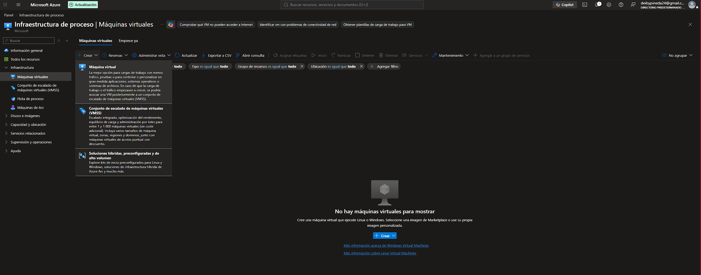

---

## 2. Crear una máquina virtual
Pantalla inicial del asistente para crear una nueva VM.

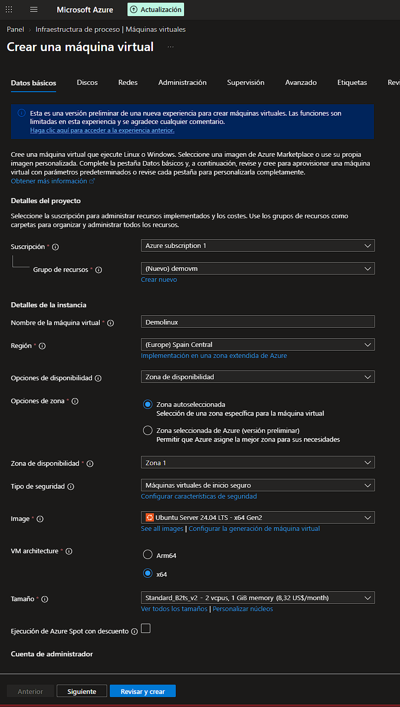

---

## 3. Datos básicos de la VM
Configuración principal de la instancia:

- Nombre de la VM  
- Región  
- Zona de disponibilidad  
- Imagen: Ubuntu Server 24.04 LTS  
- Arquitectura x64  
- Tamaño Standard_B2ts_v2  
- Puertos públicos HTTP (80) y SSH (22)

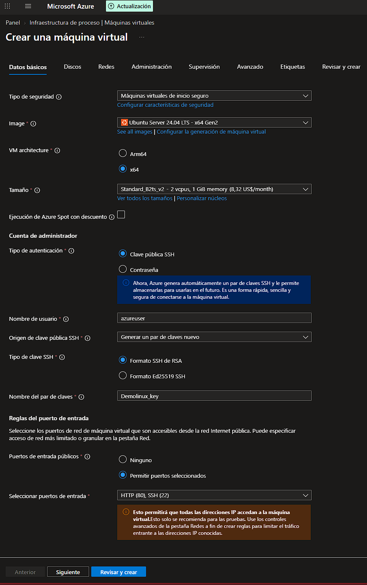

---

## 4. Configuración de discos
Disco del sistema operativo, tipo de almacenamiento y opciones avanzadas.

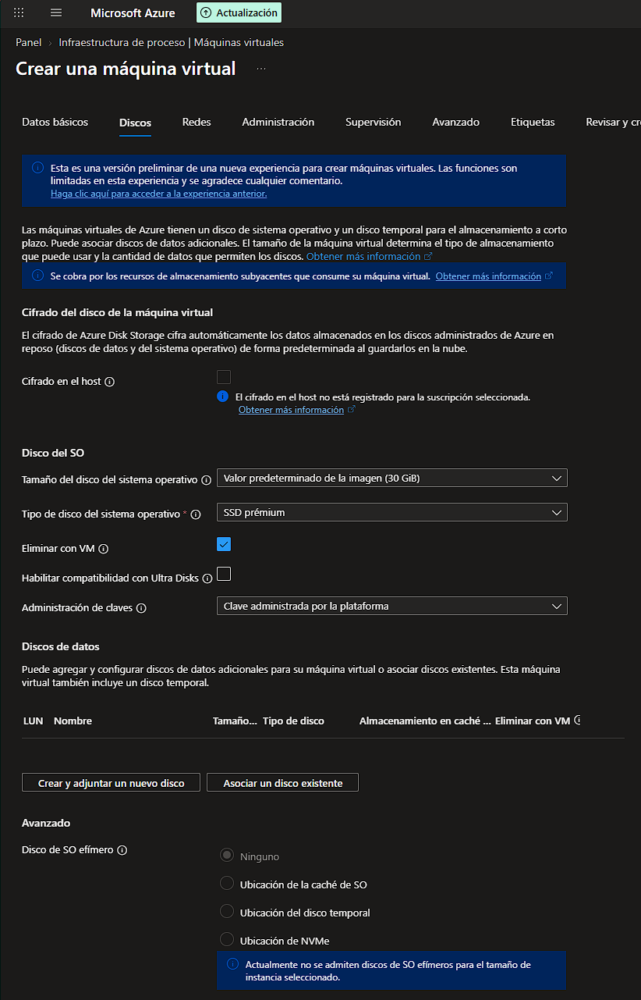

---

## 5. Configuración de red
Red virtual, subred, IP pública, NSG y puertos permitidos.

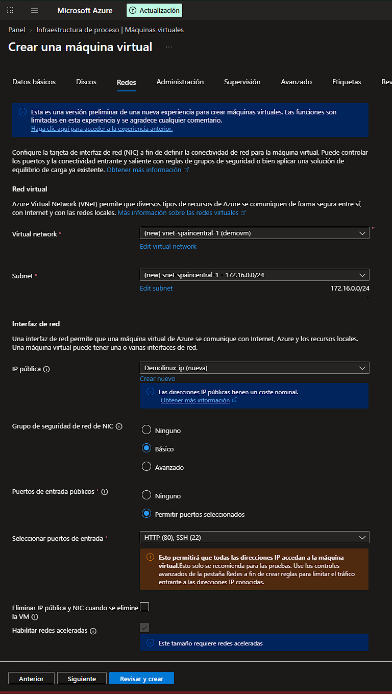

---

## 6. Script cloud-init
Script utilizado para instalar Nginx y desplegar una página web automáticamente.

```bash
#!/bin/bash
sudo su
apt-get -y update
apt-get -y install nginx
echo "<h1>Hola Mundo desde $(hostname)</h1>" > /var/www/html/index.html
```

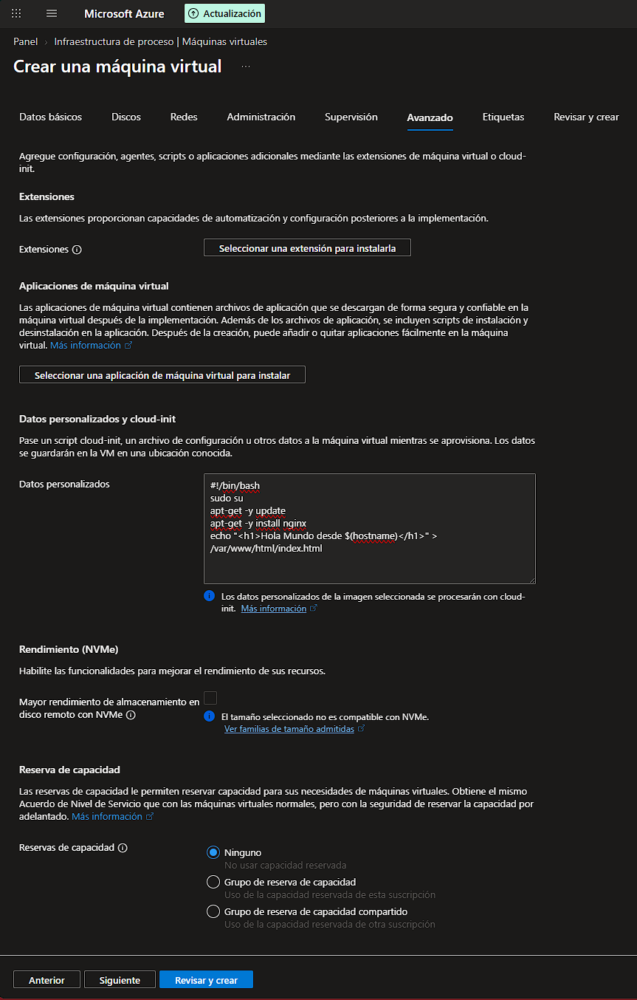

---

## 7. Revisión y creación
Resumen final de la configuración antes del despliegue.

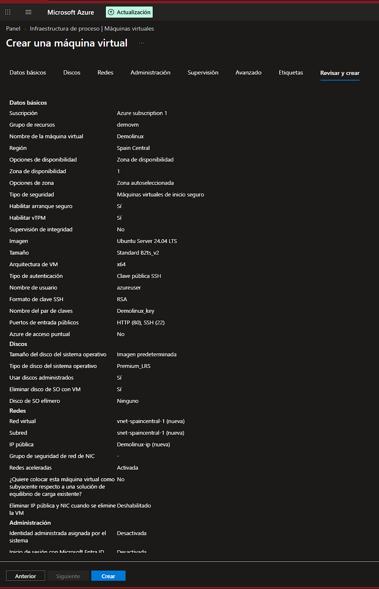

---

## 8. Implementación completada
Confirmación de que la máquina virtual fue creada correctamente.

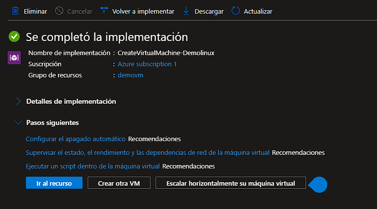

---

## 9. Panel general de la VM
Información principal de la máquina virtual:

- IP pública  
- IP privada  
- Disco  
- Red  
- SO  
- Tamaño  
- Zona  

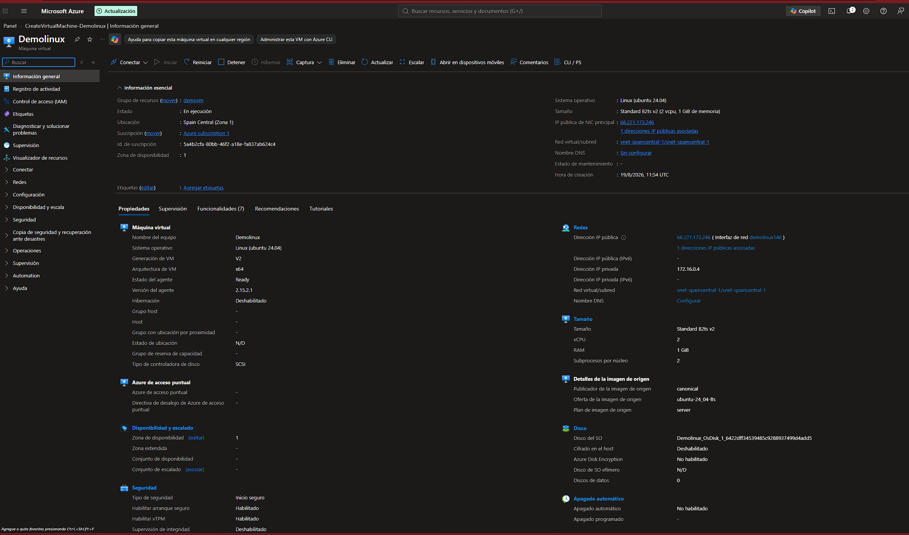

---

## 10. Validación del servicio web
Acceso vía navegador a la página generada por cloud‑init.

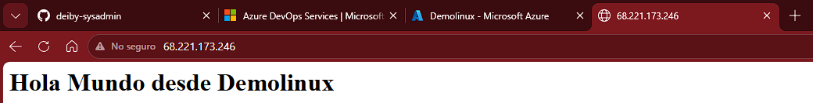

---

## 11. Conexión SSH nativa
Comando SSH y validación del acceso remoto.

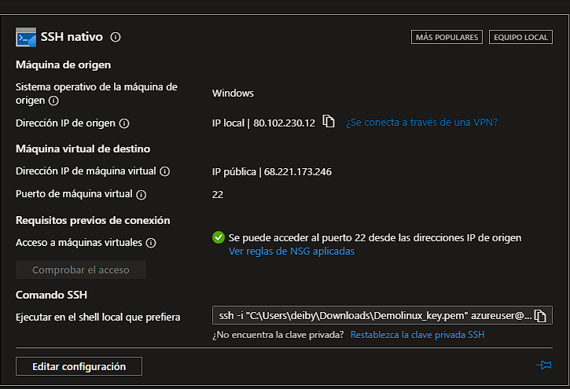

---

# Conclusión

Este módulo demuestra:

- Creación completa de una VM Linux  
- Configuración de red, discos y seguridad  
- Uso de claves SSH  
- Automatización con cloud‑init  
- Validación del servicio desplegado  
- Documentación profesional del proceso
