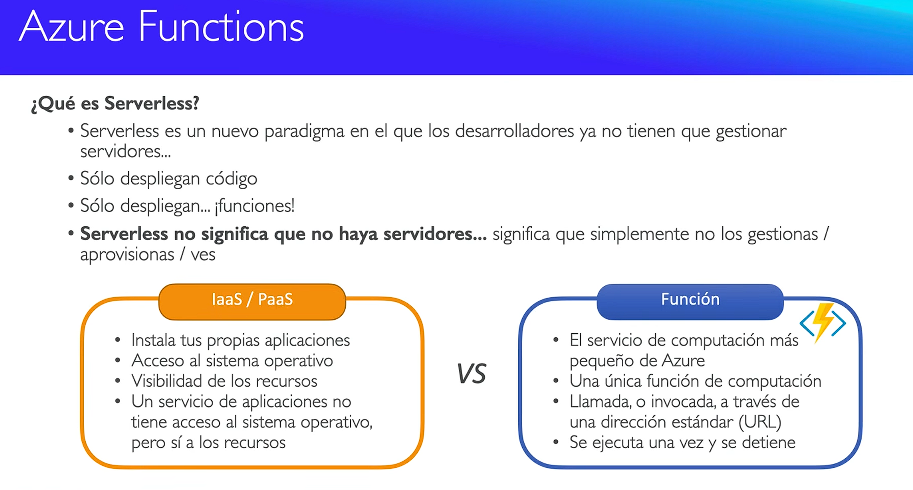
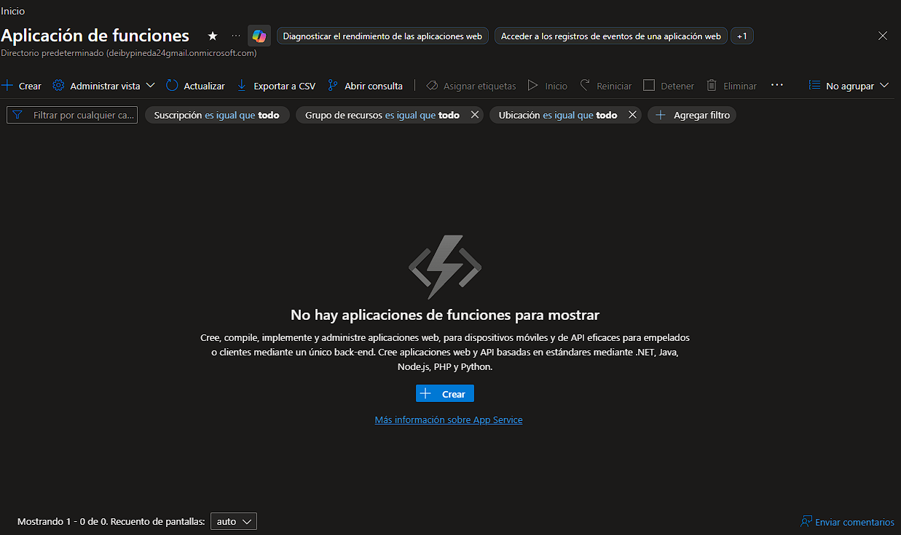
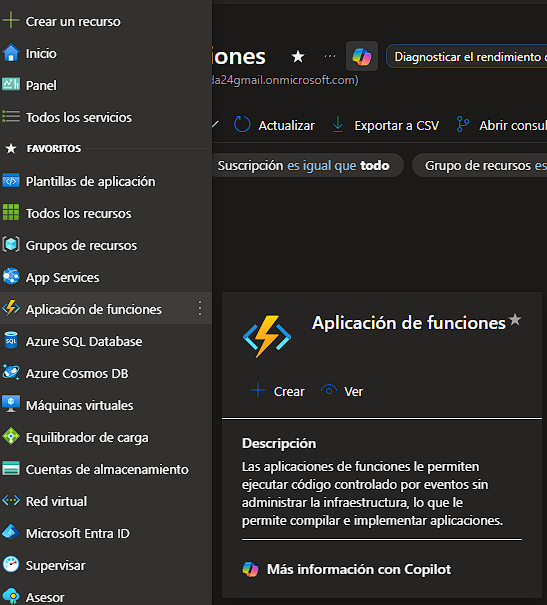
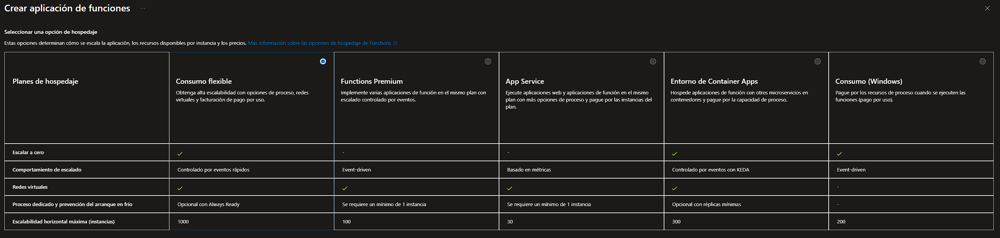
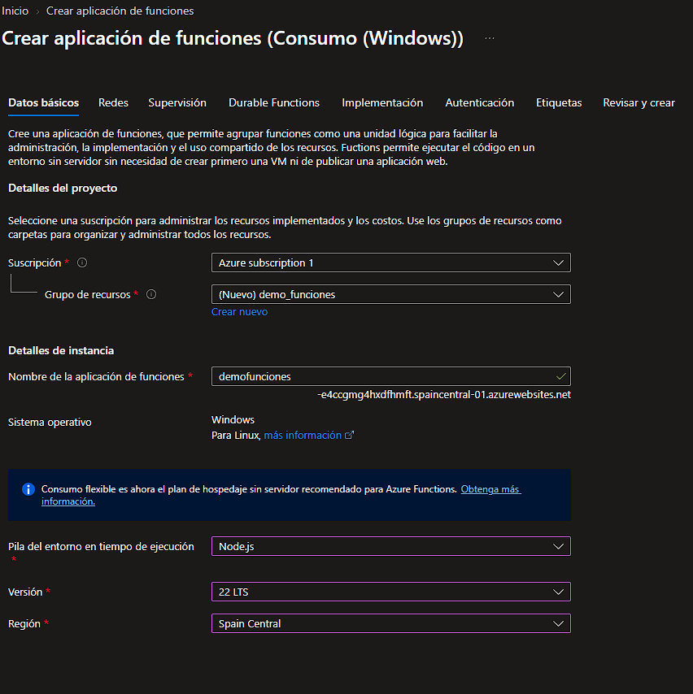
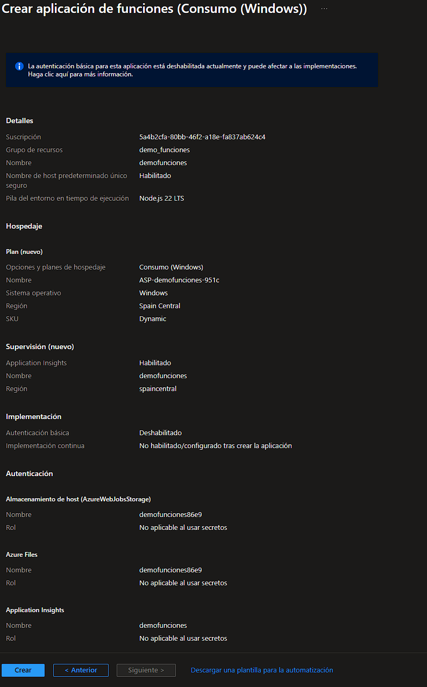
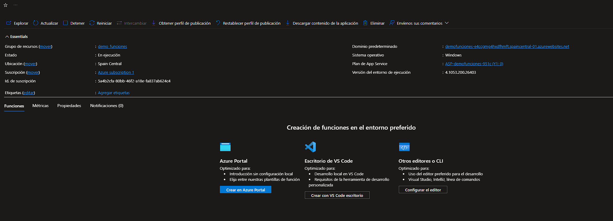
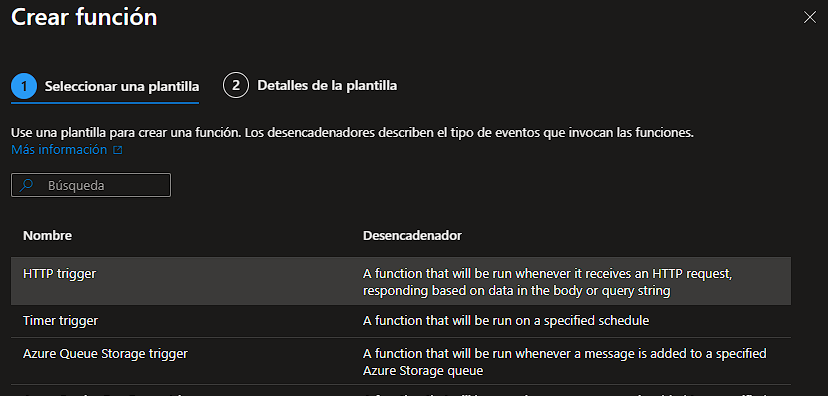
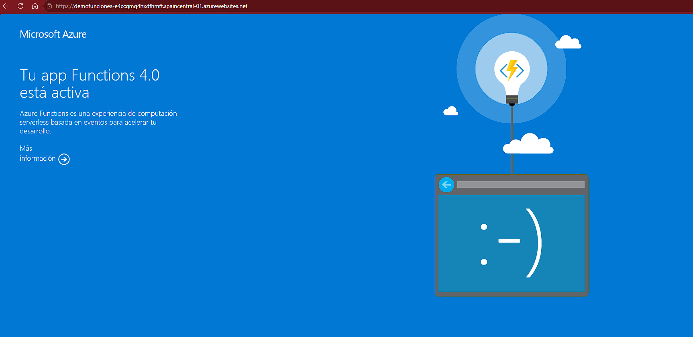

# 05. Azure Functions

Este módulo documenta la creación y validación de una **Azure Function App** en plan Consumption (Serverless) con Node.js 22 LTS sobre Windows, como ejemplo de ejecución de código bajo demanda sin gestionar infraestructura.

---

## Recursos desplegados

| Recurso | Tipo | Plan | Runtime | Coste |
|---|---|---|---|---|
| `demofunciones` | Function App | Consumption (Windows) | Node.js 22 LTS | 0 € |
| `ASP-demofunciones-951c` | App Service Plan | Dynamic (Y1) | Windows | 0 € |

**URL pública:** `https://demofunciones.e4ccgmg4hxdfhmft.spancentral-01.azurewebsites.net`
**Región:** Spain Central
**Resource Group:** `demo_funciones`

---

## Concepto: ¿Qué es Serverless?

Diagrama introductorio que explica la diferencia entre IaaS/PaaS y Azure Functions: el desarrollador solo despliega funciones y Azure se encarga de escalar, ejecutar y cobrar únicamente por el tiempo de ejecución real.

---

## Pasos realizados

### 1. Acceso al servicio

Panel inicial de Function App en Azure, sin recursos creados todavía.

Vista del servicio desde "Favoritos" con la descripción del recurso.

---

### 2. Selección del plan de hosting

Comparativa de los 5 planes disponibles (Consumo Flex, Consumo Premium, App Service, Entornos de Container Apps, Consumo Windows). Se eligió **Consumo Windows** por compatibilidad con la suscripción gratuita.

---

### 3. Datos básicos de la Function App

Configuración inicial con Node.js 22 LTS, sistema operativo Windows, región Spain Central y nuevo resource group `demo_funciones`.

---

### 4. Revisión y creación

Resumen final de validación con el plan Dynamic, Application Insights habilitado y la configuración de almacenamiento por defecto.

---

### 5. Function App creada

Overview del recurso ya desplegado, mostrando el estado, plan de hosting, URL pública, región y versión del runtime.

---

### 6. Crear función desde plantilla

Vista de las plantillas disponibles para crear la primera función: HTTP trigger, Timer trigger, Azure Queue Storage trigger, entre otras.

---

### 7. Smoke test en el navegador

Acceso a la URL raíz confirmando que la Function App responde correctamente con la página "Tu app Functions 4.0 está activa".

---

## Conclusiones

- El plan **Consumption (Serverless)** cobra únicamente por el tiempo real de ejecución, ideal para cargas intermitentes.
- **Windows Consumption** no soporta Python; para Python se necesita un plan Linux o App Service Plan.
- La URL raíz de la Function App responde con una página de validación sin necesidad de crear funciones previas.
- Las **plantillas de triggers** (HTTP, Timer, Queue, etc.) aceleran el desarrollo de funciones listas para producción.
- En este lab se eligió **Node.js 22 LTS** por compatibilidad con la suscripción gratuita de Azure.

