# 06. Redes Virtuales en Azure

Este módulo documenta la creación y configuración de una **Azure Virtual Network (VNet)**, sus subredes y la aplicación de un **Network Security Group (NSG)** con una regla de entrada SSH, como base para conectar recursos de Azure de forma segura.

---

## Recursos desplegados

| Recurso | Tipo | Detalle | Coste |
|---|---|---|---|
| `vnet-lab-deiby` | Virtual Network | Espacio `10.0.0.0/16` | 0 € |
| `default` | Subnet | `10.0.0.0/24` | 0 € |
| `defaultA` | Subnet | `10.0.1.0/24` | 0 € |
| `NGS1` | Network Security Group | Regla SSH entrada | 0 € |

**Región:** Spain Central
**Resource Group:** `demo_redes`

---

## Conceptos teóricos

### Azure Virtual Network

Diagrama introductorio que explica qué es una VNet: una red privada aislada en la nube que permite conectar recursos de Azure de forma segura, crear subredes, aplicar filtros de seguridad y gestionar bloques de IP privadas.

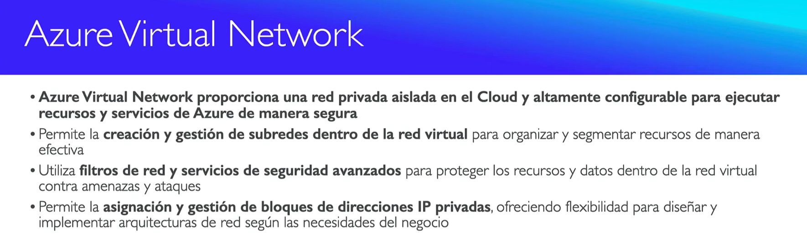

### Subredes (Subnets)

Explica cómo particionar una VNet en subredes públicas (accesibles desde Internet) y privadas (aisladas), donde cada subred debe tener un intervalo CIDR único dentro del espacio de direcciones.

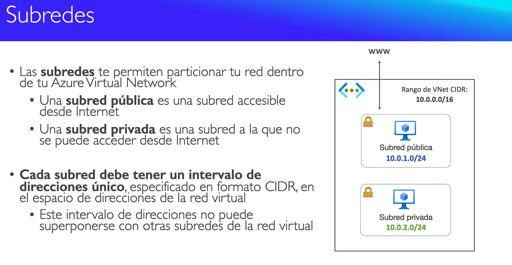

### VNet Peering (Emparejamiento)

Diagrama que muestra cómo conectar dos VNet de forma privada, sin pasar por Internet. Las VNets no deben tener CIDR superpuestos y la conexión **no es transitiva**.

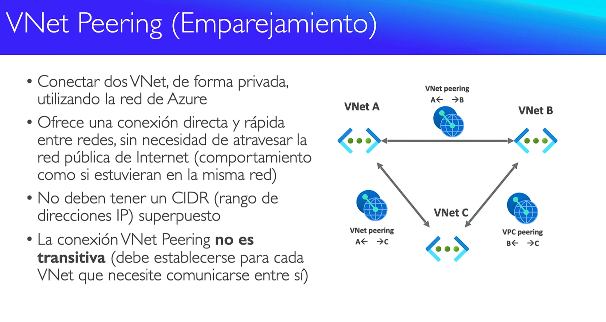

---

## Pasos realizados

### 1. Acceso al servicio

Búsqueda del servicio Red Virtual en los favoritos del portal.

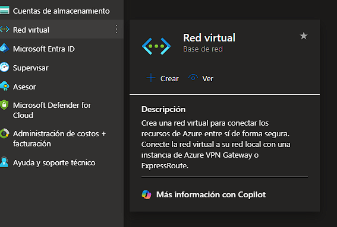

Panel inicial de Redes Virtuales, sin recursos creados todavía.

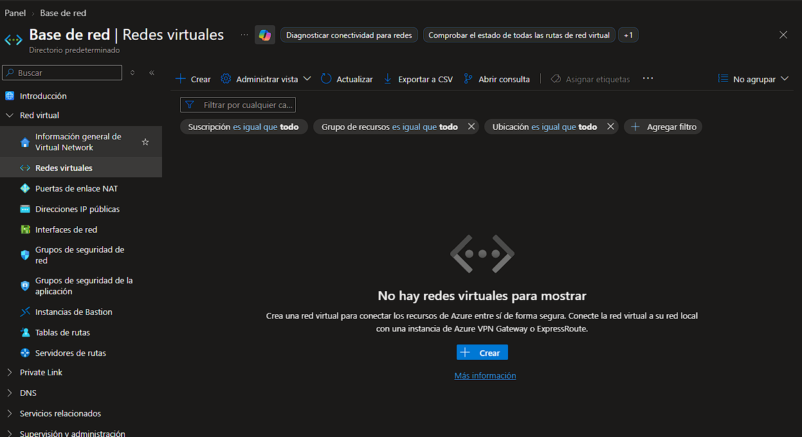

---

### 2. Creación de la VNet

Asistente de creación con nombre `vnet-lab-deiby`, resource group `demo_redes` y región Spain Central.

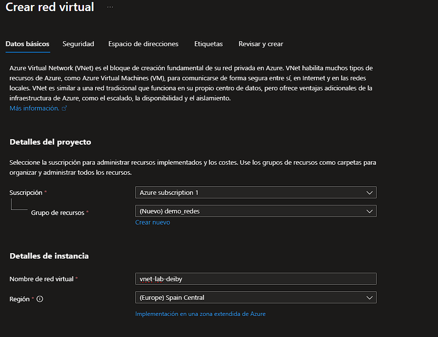

Configuración del espacio de direcciones `10.0.0.0/16` y la subnet `default` con rango `10.0.0.0/24`.

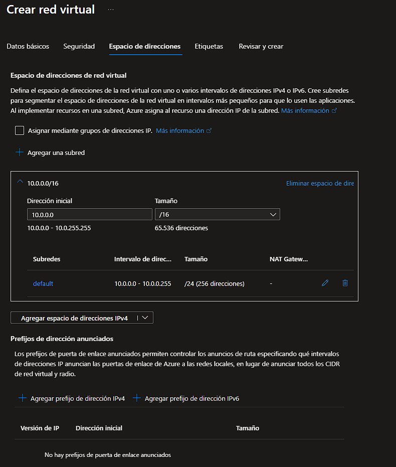

Resumen final de validación antes del despliegue, con Bastion y Firewall deshabilitados.

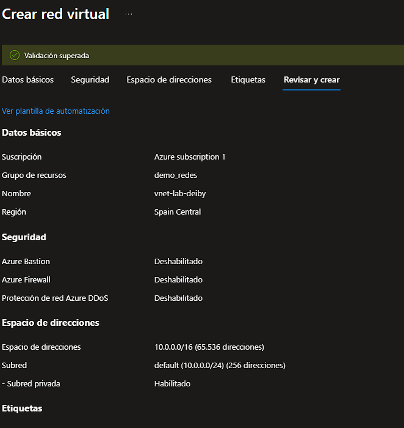

Confirmación de que la implementación se completó correctamente.

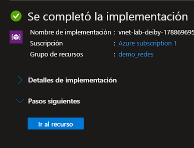

---

### 3. Validación de la VNet

Overview del recurso ya creado, mostrando el espacio de direcciones, número de subredes y servidores DNS.

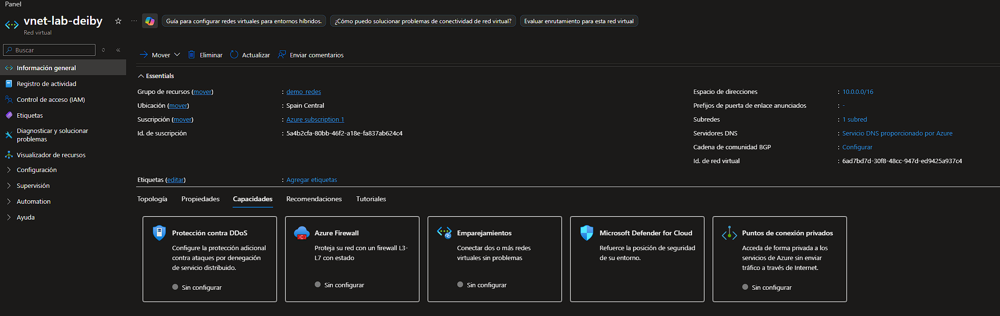

Vista detallada del espacio de direcciones de la VNet.

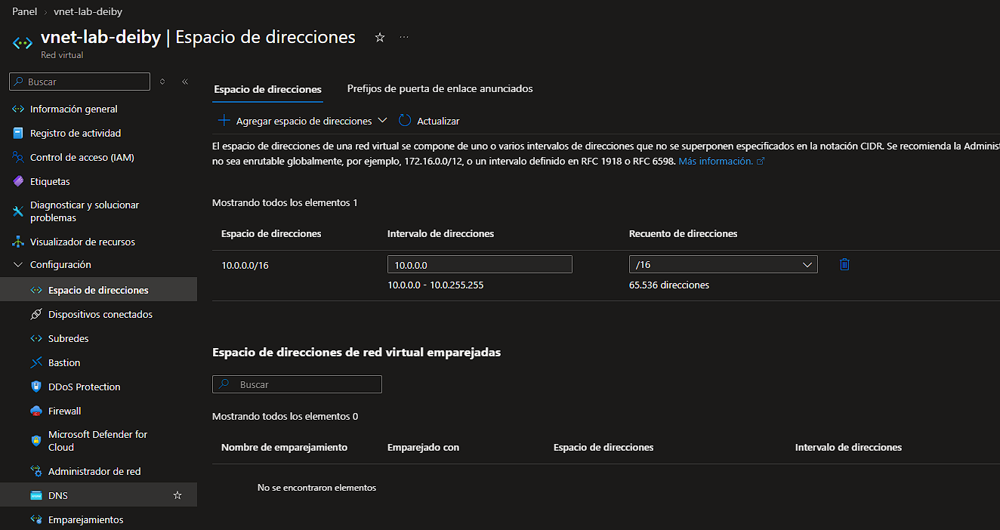

---

### 4. Creación de subred adicional

Formulario para agregar la subred `defaultA` con rango `10.0.1.0/24`, marcada como subred privada.

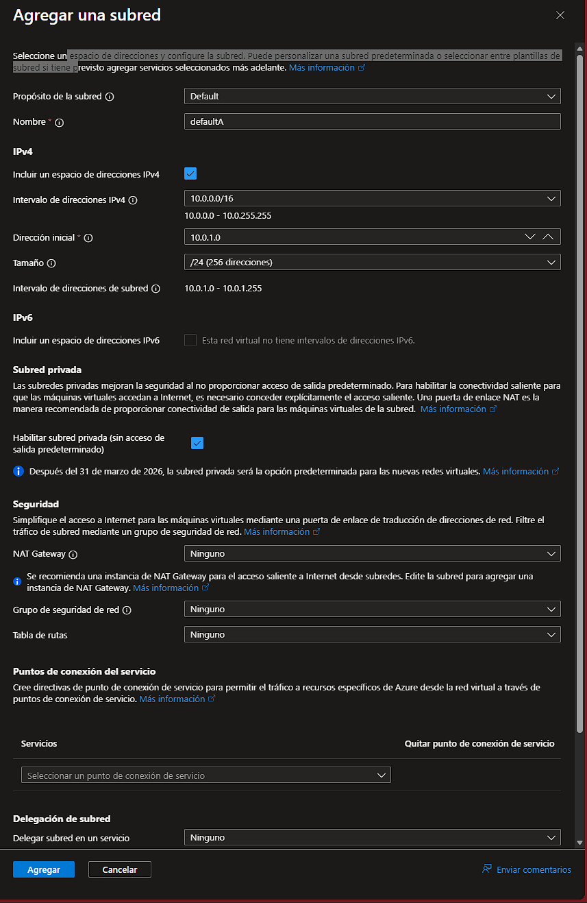

Lista de subredes de la VNet, ahora con `default` y `defaultA`.

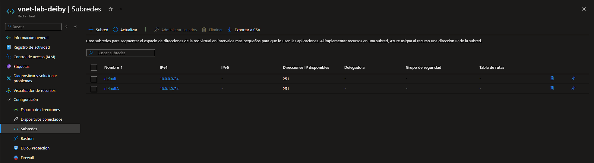

---

### 5. Creación del Network Security Group

Búsqueda del servicio "Grupo de seguridad de red" desde el portal.

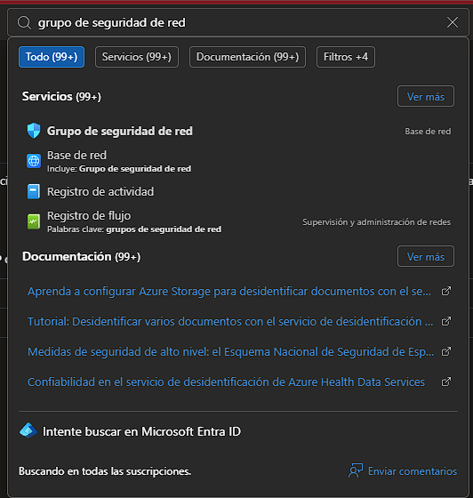

Asistente de creación del NSG llamado `NGS1`, en el resource group `demo_redes` y región Spain Central.

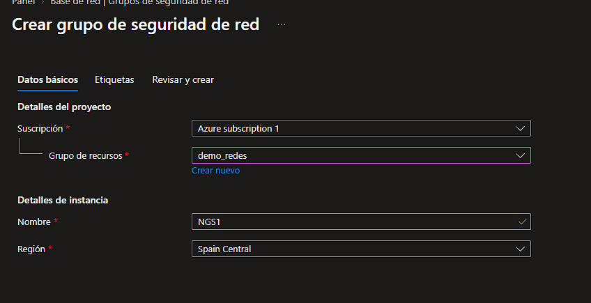

Confirmación de que la implementación del NSG está en curso.

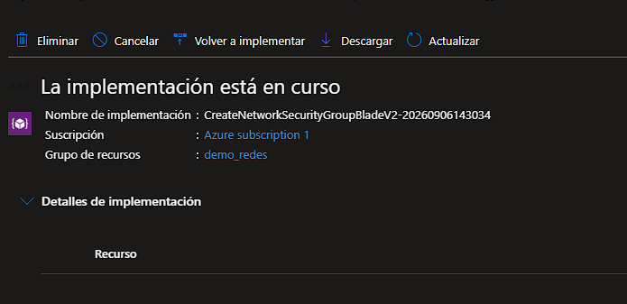

---

### 6. Asociación del NSG a las subredes

Vista del blade "Subredes" del NSG recién creado, sin asociaciones todavía.

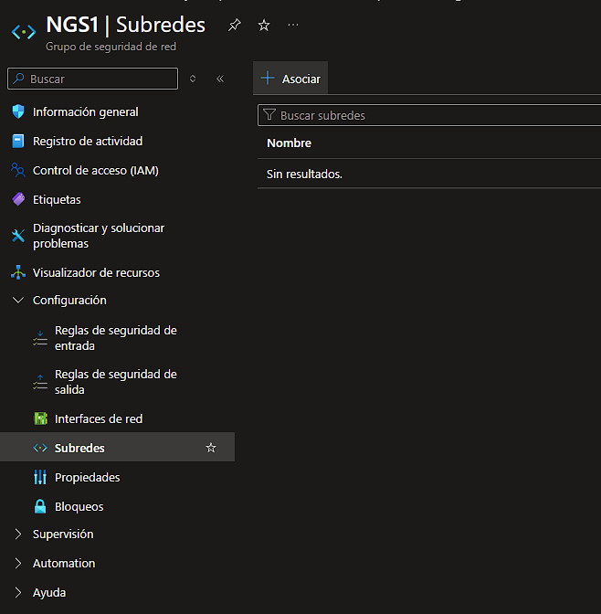

Formulario para asociar el NSG a la subred `default` de la VNet.

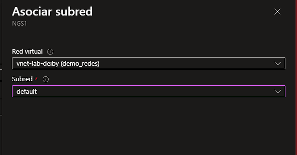

Listado de subredes ya asociadas al NSG: `default` y `defaultA`.

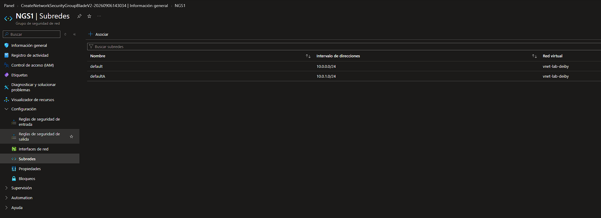

---

### 7. Regla de seguridad SSH

Vista del menú lateral del NSG con las opciones "Reglas de seguridad de entrada" y "Reglas de seguridad de salida".

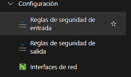

Formulario para crear la regla de entrada: origen `10.0.0.0/24`, servicio SSH, puerto destino 22, protocolo TCP, acción Permitir, prioridad 100.

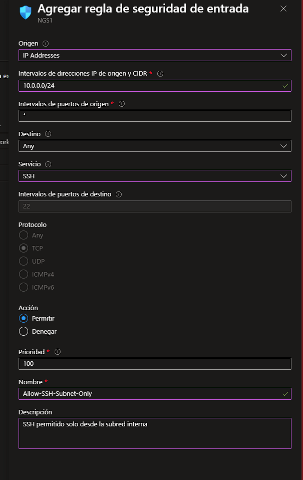

Regla `Allow-SSH-Subnet-Only` creada y visible en la lista de reglas de entrada.

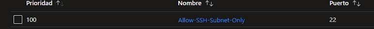

---

## Conclusiones

- Las **VNet son gratuitas** en Azure; solo los recursos asociados (Bastion, VPN Gateway) tienen coste.
- El espacio de direcciones y las subredes deben planificarse con CIDR que no se superpongan.
- Los **NSG** filtran tráfico a nivel de subred o NIC y se evalúan por orden de prioridad.
- La regla creada permite SSH solo desde la subred interna `10.0.0.0/24`, lo que reduce la superficie de ataque desde Internet.
- **VNet Peering** conecta VNets de forma privada y rápida, pero requiere peering explícito entre cada par (no es transitivo).

