# 07. Almacenamiento en Azure

Este módulo documenta la creación de una **Azure Storage Account**, un contenedor Blob privado y la carga de un archivo, como ejemplo de almacenamiento de objetos en la nube para imágenes, vídeos, logs y backups.

---

## Recursos desplegados

| Recurso | Tipo | Detalle | Coste |
|---|---|---|---|
| `stdeibylab01` | Storage Account | Standard, LRS, Hot | 0 €* |
| `contenedor-pruebadeiby` | Contenedor Blob | Acceso privado (sin anónimo) | 0 € |

\* *El coste 0 € aplica mientras se mantenga por debajo de los 5 GB y 20.000 lecturas gratuitas del tier gratuito.*

**Región:** Spain Central
**Resource Group:** `demo_storage`

---

## Conceptos teóricos

### Azure Blob Storage

Introducción a Blob Storage como servicio de almacenamiento de objetos masivo, escalable y seguro, con autenticación Entra ID, RBAC, cifrado en reposo y compatibilidad con lagos de datos.

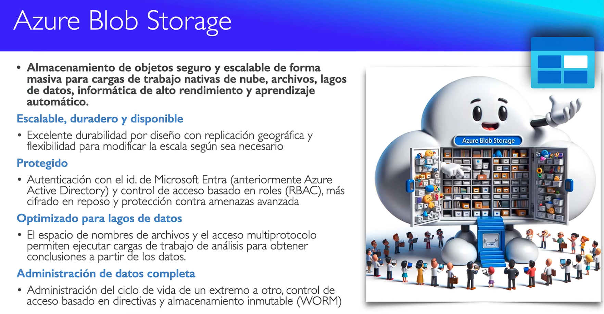

### Casos de uso de Blob Storage

Ejemplos de uso: imágenes, streaming de audio/vídeo, archivos de registro (Log Files), almacén de datos a gran escala y cualquier tipo de archivo distribuido en la nube.

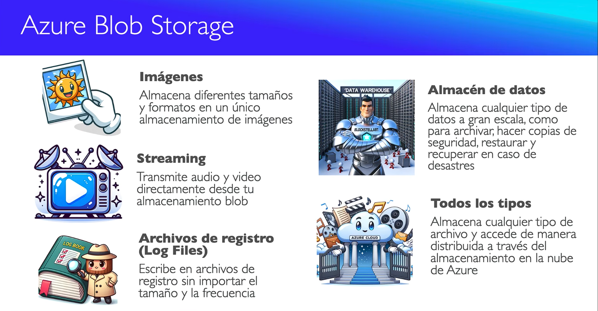

---

## Pasos realizados

### 1. Acceso al servicio

Vista del servicio "Cuentas de almacenamiento" desde el menú lateral de favoritos del portal.

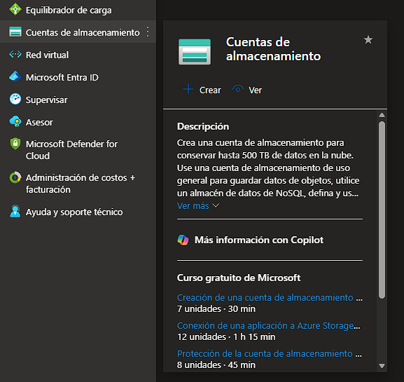

Panel principal del Centro de almacenamiento sin cuentas creadas todavía.

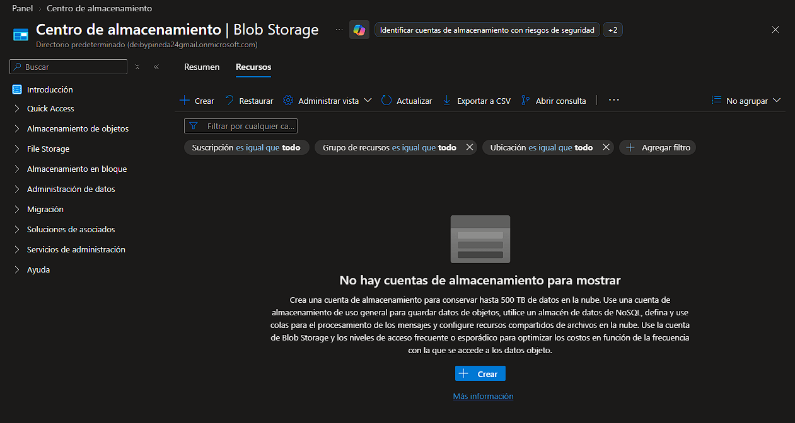

---

### 2. Creación de la Storage Account

Asistente de creación con subscription, resource group `demo_storage`, nombre único `stdeibylab01`, región Spain Central, rendimiento Estándar y redundancia LRS.

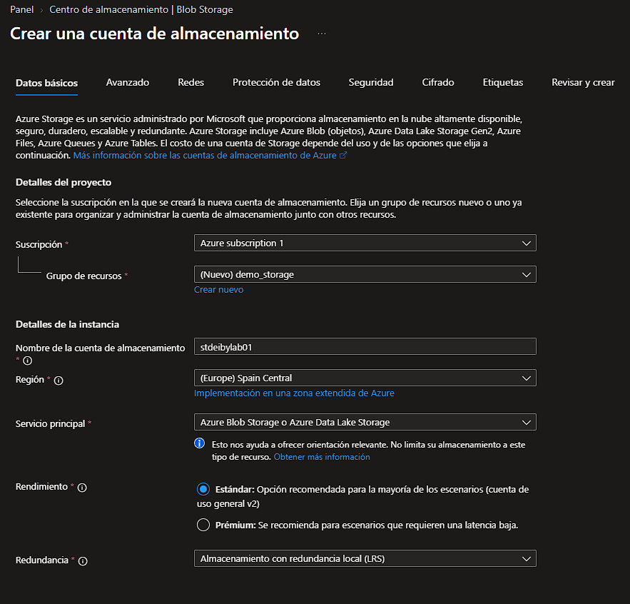

Pestaña Avanzado con las opciones de jerárquico, SFTP, NFS v3 y nivel de acceso (Hot por defecto).

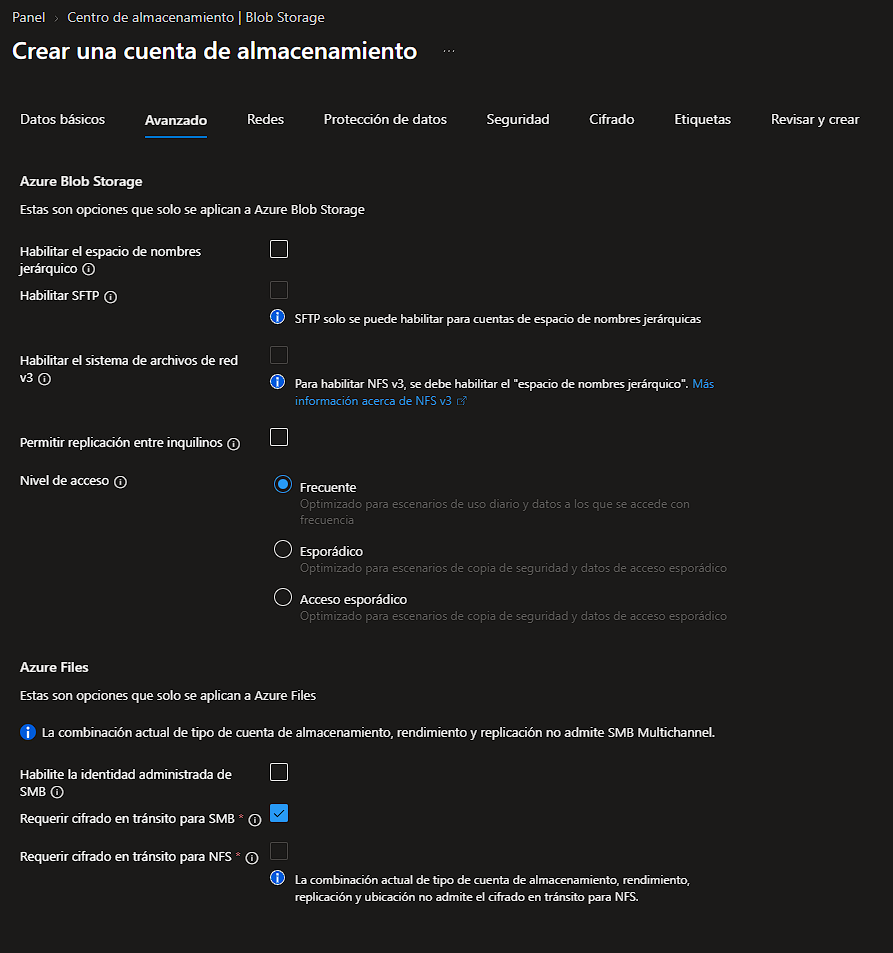

Pestaña Redes con acceso público habilitado desde todas las redes y opción de punto de conexión privado.

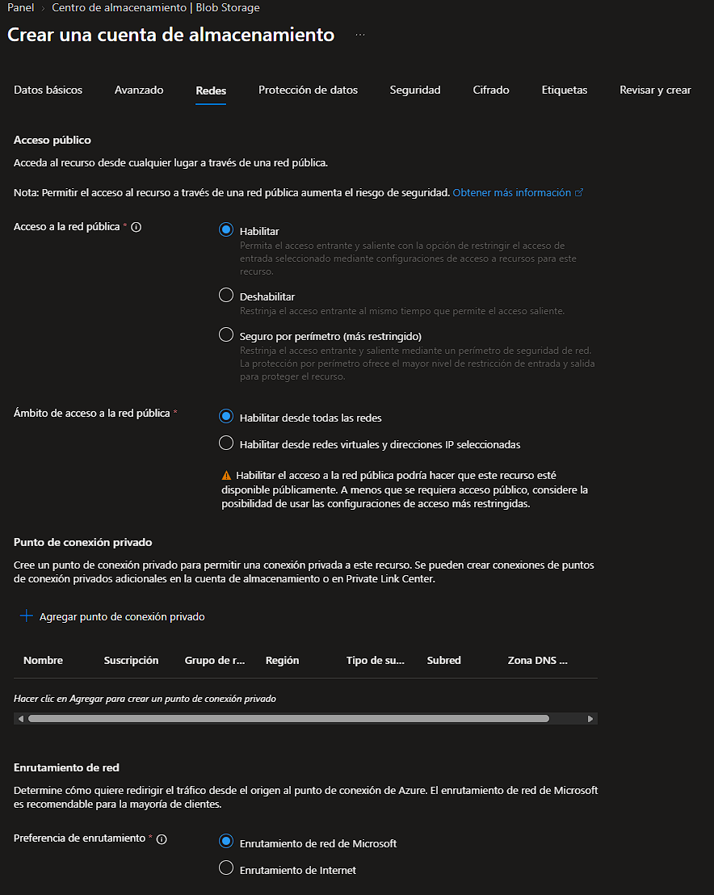

Pestaña Protección de datos con soft delete y control de versiones habilitados por defecto.

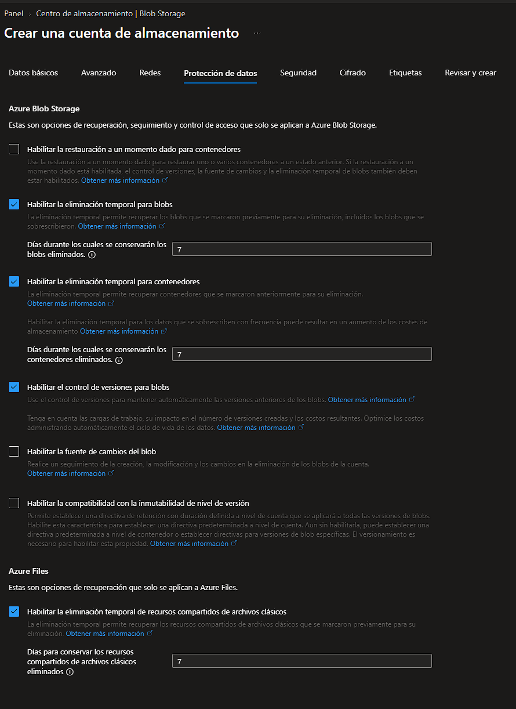

Pestaña Seguridad con TLS 1.2, transferencia segura habilitada y acceso anónimo al blob deshabilitado.

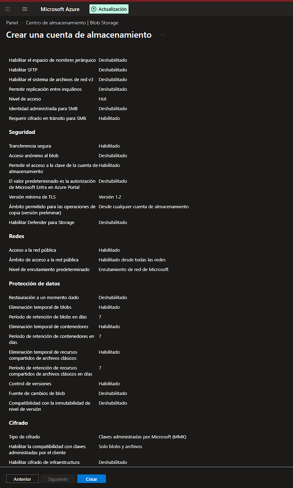

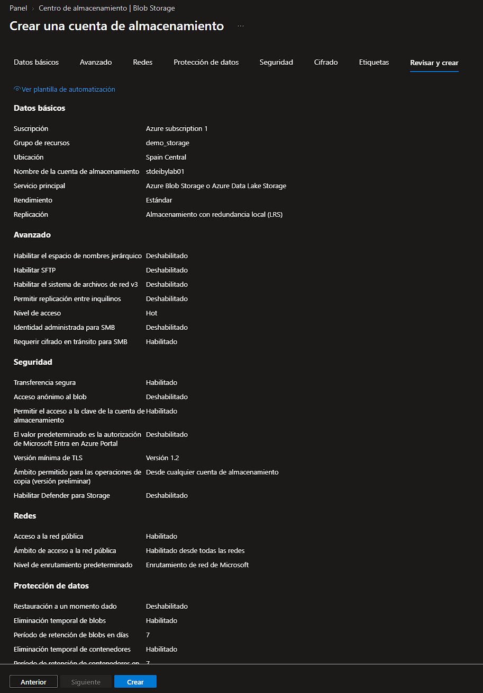

---

### 3. Implementación de la Storage Account

Notificación de Azure durante el despliegue del recurso.

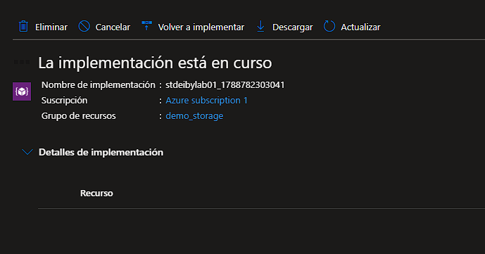

Overview de la Storage Account ya creada, mostrando propiedades, Blob service, seguridad y redes.

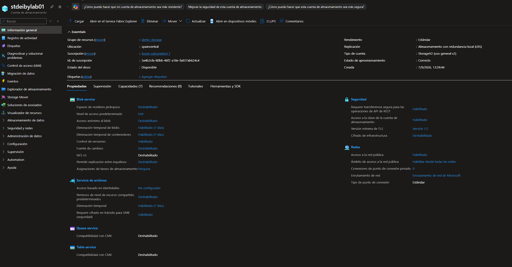

---

### 4. Creación de contenedor Blob

Vista del menú lateral con la opción "Contenedores" bajo "Almacenamiento de datos".

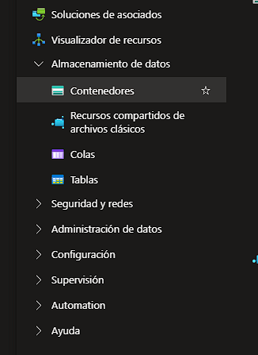

Vista inicial de contenedores con el contenedor por defecto `$logs` que Azure crea automáticamente.

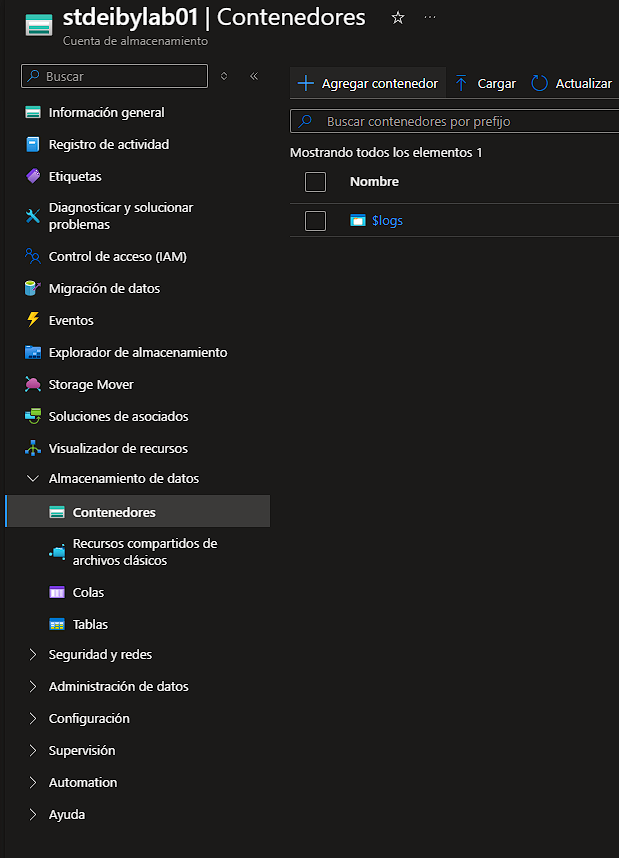

Formulario para crear un nuevo contenedor llamado `contenedor-pruebadeiby` con nivel de acceso **Privado** (sin acceso anónimo).

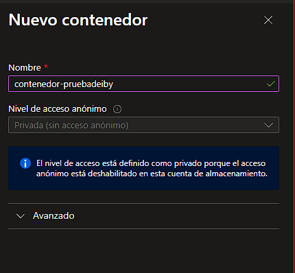

Lista de contenedores con `$logs` y `contenedor-pruebadeiby` ya creados y disponibles.

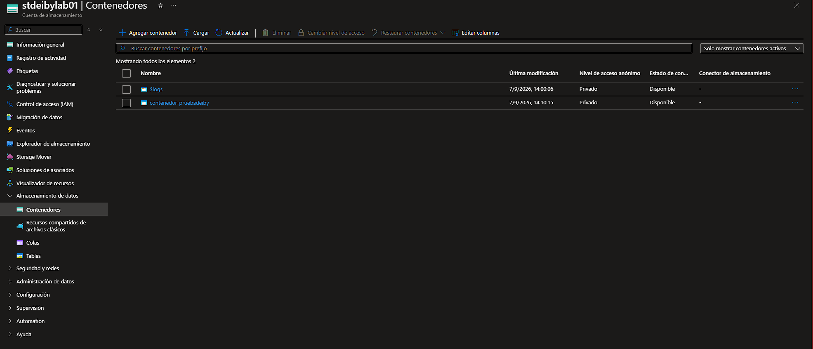

---

### 5. Carga y visualización de archivos

Formulario de carga del archivo `Microsoft-azure-linux.jpeg` al contenedor `contenedor-pruebadeiby` usando autenticación con clave de cuenta.

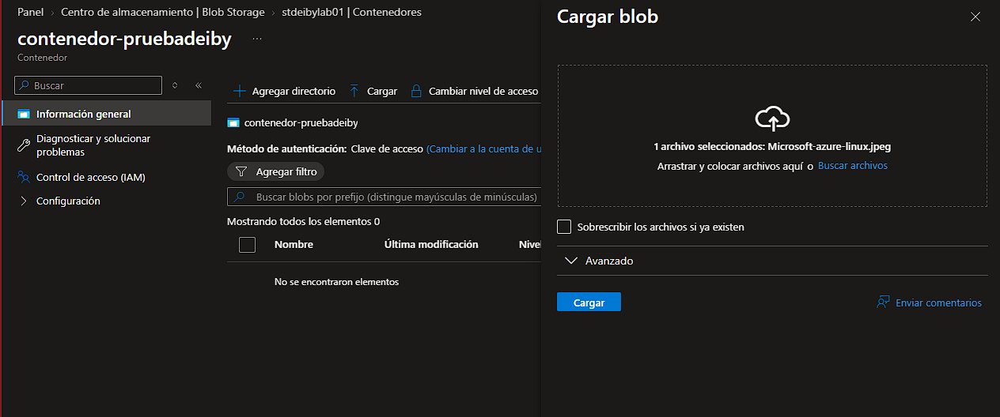

Una vez subido, el blob puede visualizarse de **dos formas distintas**:

- **Desde el panel "Editar" del portal:** Azure muestra una vista previa del archivo directamente en el navegador, como se ve en esta captura. Esto es válido aunque el contenedor sea privado, ya que la autenticación se realiza con la clave de la cuenta.

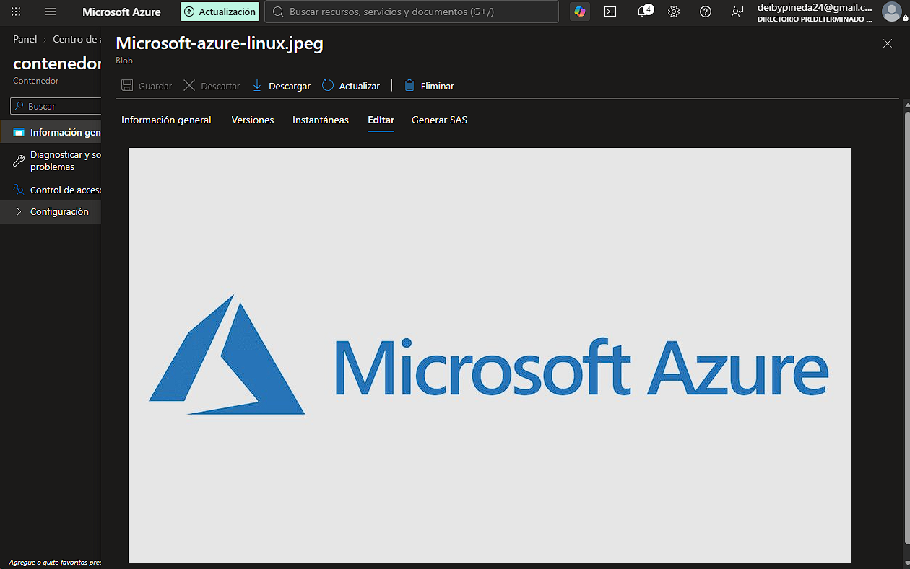

- **Desde la URL pública del blob:** solo es accesible cuando el contenedor **NO es privado** (por ejemplo, configurado como Blob o Container con acceso anónimo habilitado). En ese caso, la URL tiene el formato `https://<storage>.blob.core.windows.net/<contenedor>/<archivo>` y se puede abrir directamente en cualquier navegador.

> **Nota L2:** Para producción, mantener siempre el contenedor en modo **Privado** y compartir acceso mediante SAS Tokens temporales con permisos limitados.

---

## Conclusiones

- **Azure Storage Account** es la base para almacenar blobs, files, queues y tables.
- La opción **LRS (Locally-redundant storage)** es la más barata y suficiente para entornos de desarrollo.
- Los contenedores Blob por defecto se crean **privados**, lo que bloquea el acceso anónimo desde URL.
- Los blobs pueden **visualizarse desde el portal** (panel Editar) incluso siendo privados, gracias a la autenticación con clave de cuenta.
- Para compartir archivos sin exponer la cuenta completa, se recomienda generar un **SAS Token** con permisos y expiración concretos.
- El tier gratuito permite practicar sin consumir créditos mientras no se superen los 5 GB de almacenamiento.

