# 08. Microsoft Entra ID — Creación de usuarios

Este módulo documenta la creación de usuarios en **Microsoft Entra ID**, la asignación del rol de **Administrador global** y la validación del primer inicio de sesión con cambio de contraseña y registro de Microsoft Authenticator.

---

## Recursos creados

| Usuario | UPN | Rol | Departamento |
|---|---|---|---|
| `deiby pineda` | `deibypineda24gmail.onmicrosoft.com` | Administrador global | — |
| `Usuario Lab 01` | `usuario.lab01@deibypineda24gmail.onmicrosoft.com` | Administrador global | IT |
| `Test User` | `Test@deibypineda24gmail.onmicrosoft.com` | Miembro | — |

**Tenant:** deibypineda24gmail.onmicrosoft.com

---

## Concepto: Características de Microsoft Entra ID

Diapositiva introductoria que resume las 4 características principales de Entra ID: gestión de identidades y acceso (SSO, MFA), integración de aplicaciones, plataforma para desarrolladores y seguridad avanzada (Entra ID Protection).

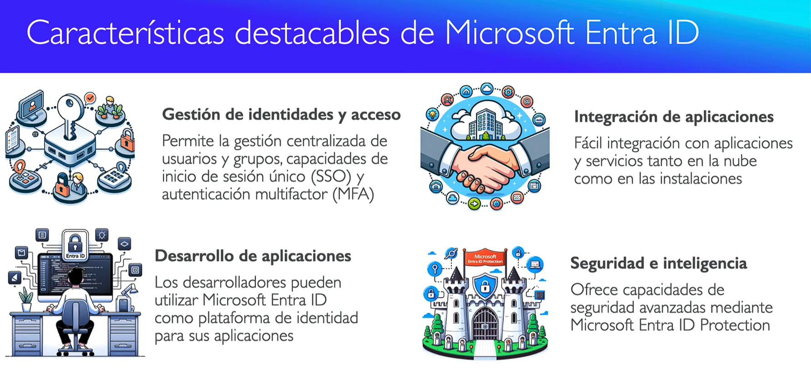

---

## Pasos realizados

### 1. Acceso al servicio

Vista del menú lateral de **Microsoft Entra** en el Centro de administración, con el botón "Nuevo usuario" desplegado mostrando las opciones "Crear un usuario nuevo" e "Invitar usuario externo".

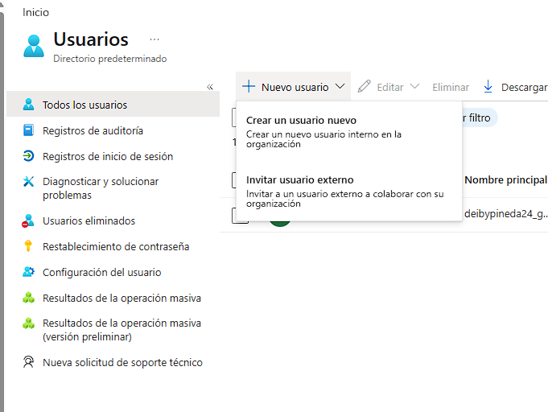

Overview del Centro de administración de Microsoft Entra con el directorio predeterminado, métricas (1 usuario, 0 grupos) y la guía de implementación.

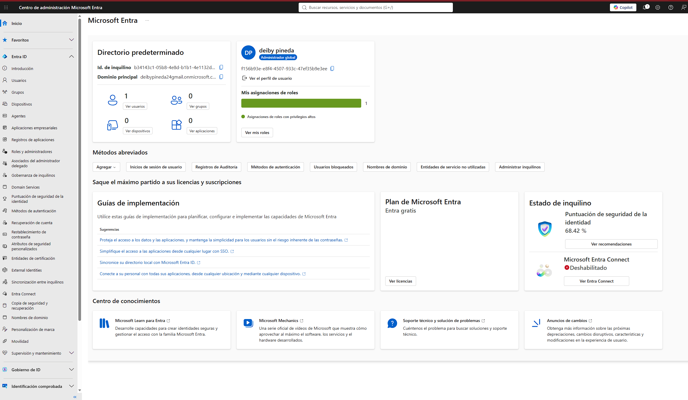

---

### 2. Creación del primer usuario (`Usuario Lab 01`)

Formulario de creación en la pestaña **Datos básicos** con el nombre principal `usuario.lab01@deibypineda24gmail.onmicrosoft.com` y nombre para mostrar `Usuario Lab 01`.

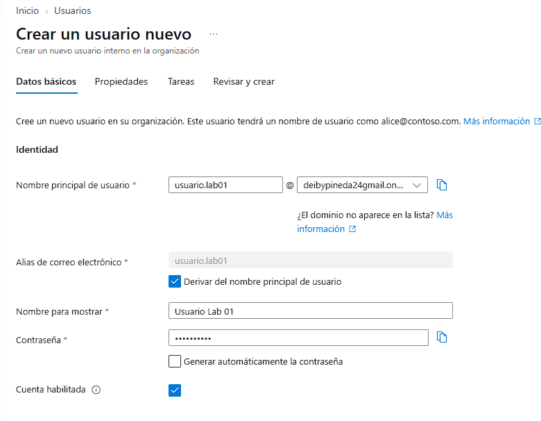

Pestaña **Propiedades** rellenada con Puesto `IT Support L2` y Departamento `IT`.

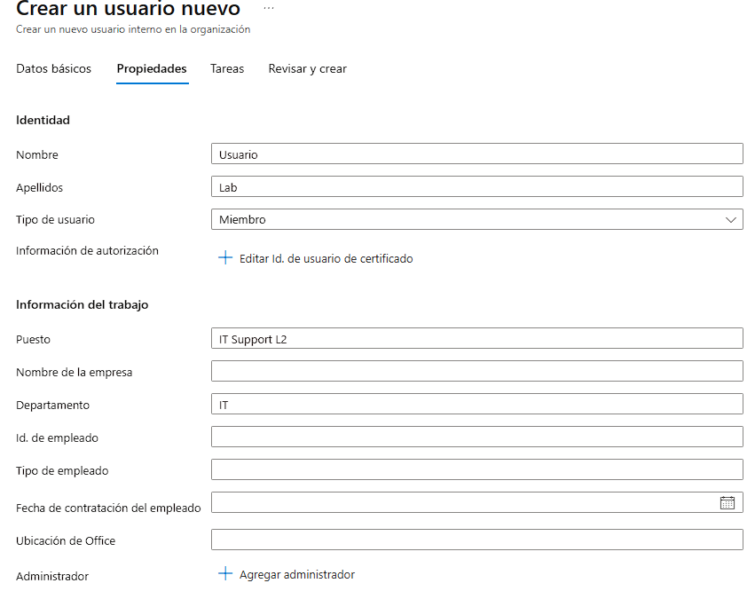

Pestaña **Tareas** con la asignación de roles del directorio (panel de **Administrador global**).

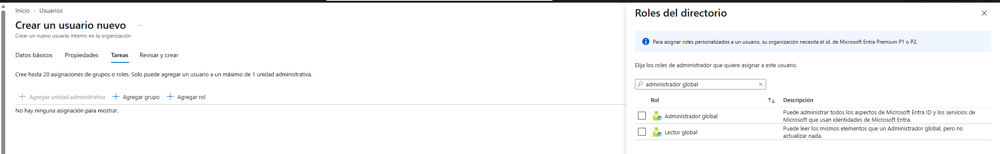

Pestaña **Revisar y crear** con el resumen completo: UPN, nombre para mostrar, propiedades y rol asignado.

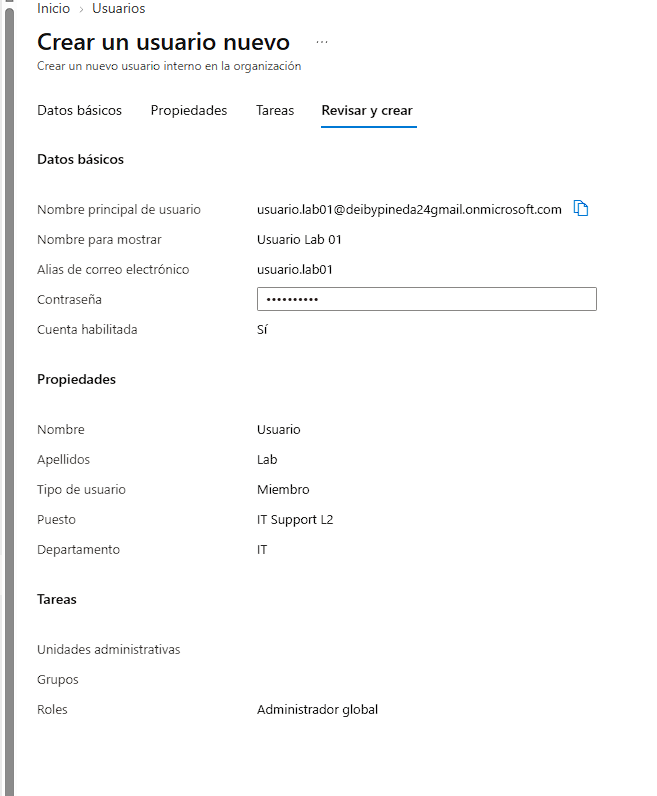

Lista de usuarios del directorio mostrando los dos usuarios existentes.

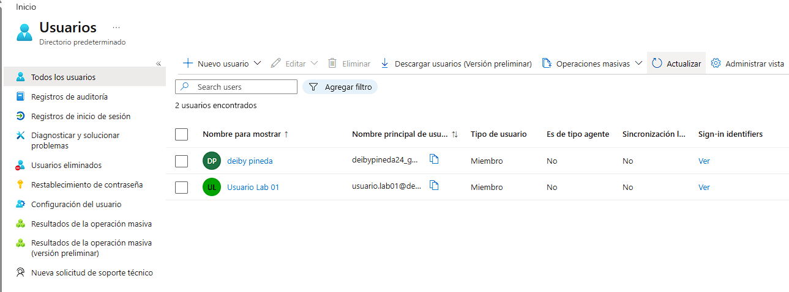

Perfil detallado del usuario recién creado, con su Id. de objeto, fecha de creación, pertenencia a grupos y rol asignado.

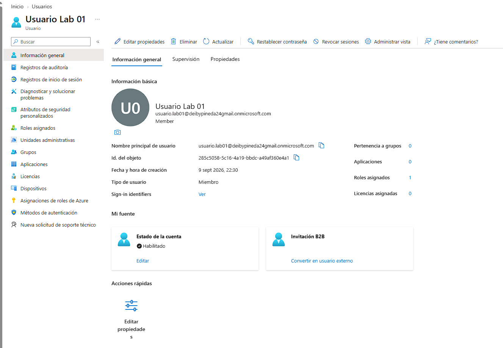

---

### 3. Validación del primer inicio de sesión

Para comprobar que el usuario estaba activo, se cerró la sesión del administrador principal y se inició sesión con el nuevo `usuario.lab01@deibypineda24gmail.onmicrosoft.com`.

Pantalla de Microsoft que pide el **nombre principal de usuario** (UPN).

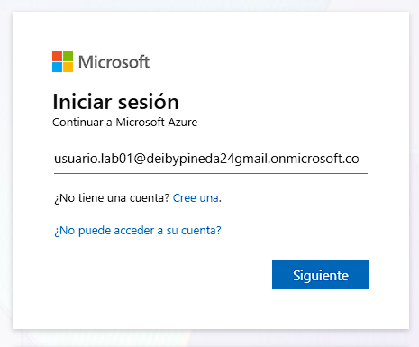

Pantalla para **escribir la contraseña** proporcionada en la creación.

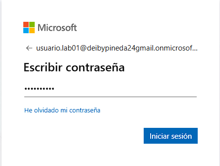

Como era el primer inicio de sesión, el sistema pidió **actualizar la contraseña** por seguridad.

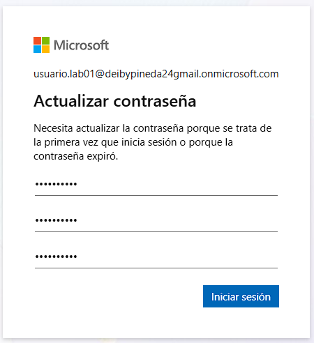

Tras el cambio, se solicitó la instalación de **Microsoft Authenticator** para registrar el segundo factor de autenticación (MFA).

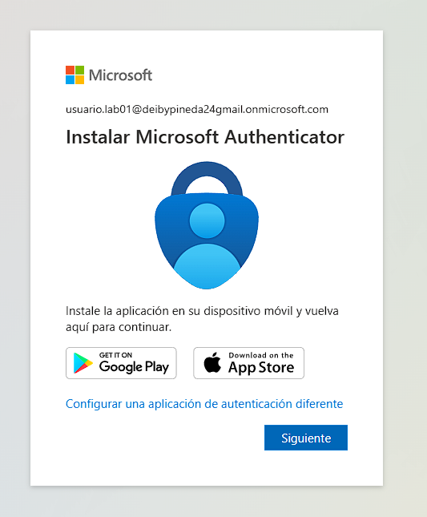

---

### 4. Creación de un segundo usuario desde el nuevo admin

Como el nuevo usuario ya tenía el rol de **Administrador global**, podía acceder a la administración de Entra ID.

Búsqueda del servicio Microsoft Entra ID desde la barra superior del portal (logueado ya como `usuario.lab01`).

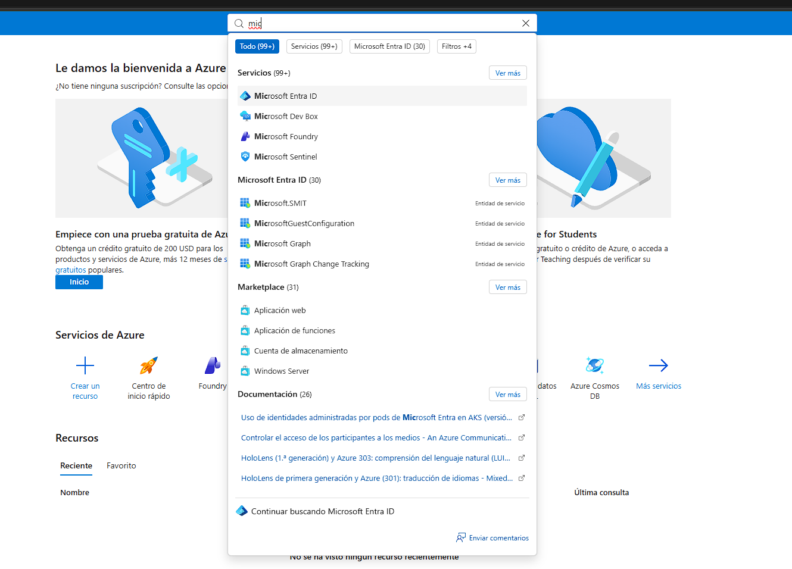

Vista de la lista de usuarios desde la sesión del nuevo administrador global.

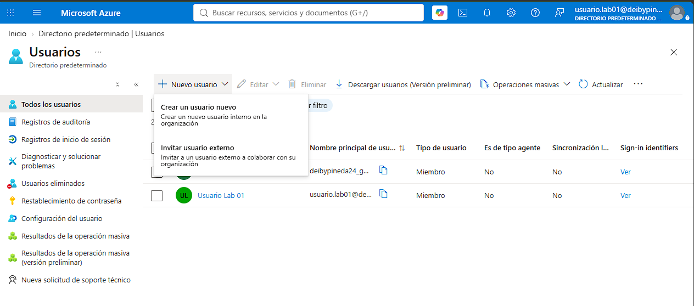

Formulario de creación del usuario `Test User` con UPN `Test@deibypineda24gmail.onmicrosoft.com`.

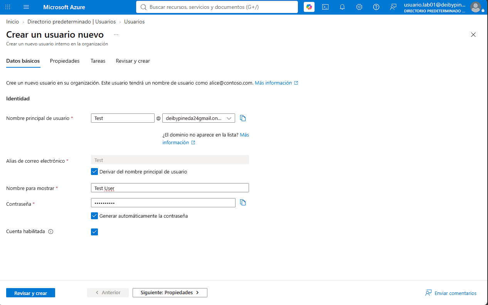

Revisar y crear del nuevo usuario Test User.

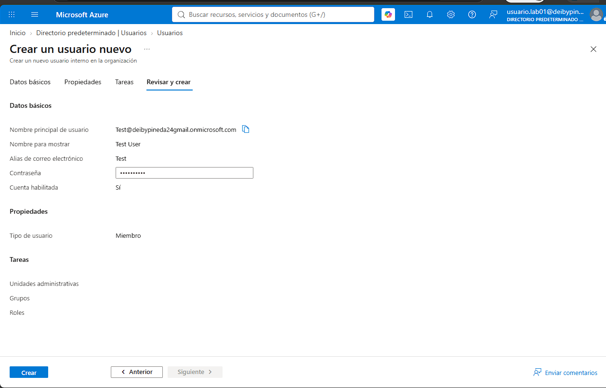

Lista final con los 3 usuarios del directorio: el administrador original, Test User y Usuario Lab 01.

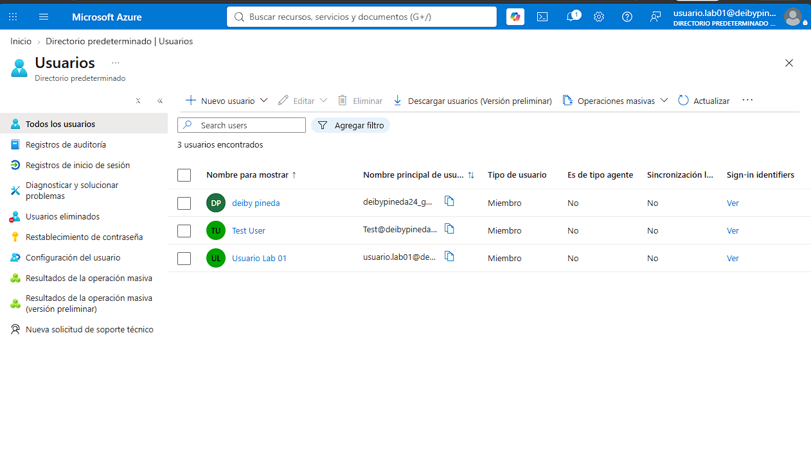

---

## Conclusiones

- En **Microsoft Entra ID** los usuarios internos se crean con UPN del tipo `usuario@dominio.onmicrosoft.com`.
- Asignar el rol de **Administrador global** da control total sobre el tenant, por lo que debe limitarse a cuentas de confianza.
- En el **primer inicio de sesión** el sistema fuerza el cambio de contraseña y, si hay directivas activas, pide registrar **Microsoft Authenticator** (MFA).
- Un usuario con permisos administrativos puede crear nuevos usuarios y administrarlos sin necesidad de la cuenta original.
- El **centro de administración de Microsoft Entra** (`entra.microsoft.com`) ofrece una experiencia simplificada frente al portal Azure clásico para tareas de identidad.

